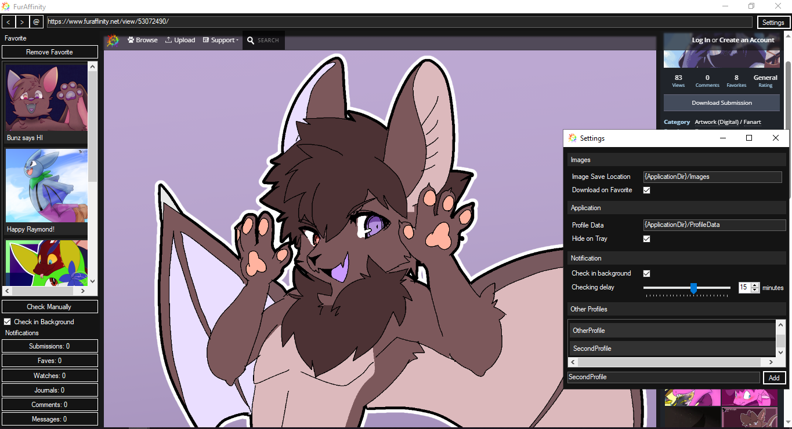

# FurAffinity Desktop
An unofficial client for furaffinity.net! Only supports Windows for now

## Features
- Keeping itself alive in the background (like Discord)
- Sends you notification if there's a new notification!
- Multiple profiles! (Supports multiple accounts!)

## How to use
- Download the app: [Latest version](https://github.com/ReDarkTechnology/FurAffinity-Desktop/releases/latest)
- Open the app
- If you close the app it will still run in the background, right click on the tray icon to close it!
- Press F4 to hide/show the toolbar!

## Credits
- [ReDark Technology](https://github.com/ReDarkTechnology)
- [HtmlAgilityPack](https://github.com/zzzprojects/html-agility-pack)
- [WebView2](https://developer.microsoft.com/en-us/microsoft-edge/webview2/)